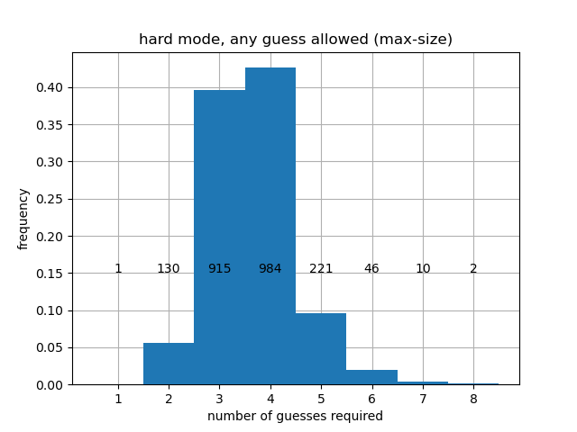
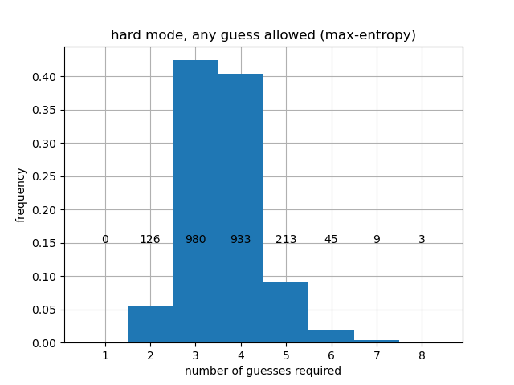

# Overview

This is a simple [Wordle](https://www.powerlanguage.co.uk/wordle/) solver written in [Julia](https://julialang.org/).
The main code is in the notebook [wordle_solver.ipynb](wordle_solver.ipynb), which contains all necessary instructions. For more information about how the solver works, keep reading!

## About Wordle

Wordle uses two word lists.

- `solutions.txt` is the set of words that might appear as solutions to the puzzle. This list contains 2315 words.
- `nonsolutions.txt` is the set of words that can be used as guesses, but will never appear as solutions. Contains 10657 words.

I extracted these word lists directly from the Wordle source code (see [this article](https://bert.org/2021/11/24/the-best-starting-word-in-wordle/) for details). Every time we guess a word, we get to know whether any of the letters were correct and if they were in the right location in the word, similar to the game [Mastermind](<https://en.wikipedia.org/wiki/Mastermind_(board_game)>) but with words instead of colors. The information returned narrows down the list of possible solutions. Of course, we want to narrow down the list as much as possible, but the amount of narrowing depends on the information we receive.

**Example:** Initially, there are 2315 possible solutions. Suppose we try "STUMP" as our first word. Here are some possibilities:

- `"00000"`: none of the letters were correct. This still gives us useful information, and we can narrow down the list of possible solutions to 730 words.
- `"10000"`: only the "S" is in the solution, but it is in the wrong spot. This narrows down the list of possible solutions to 87 words.
- `"10201"`: the "U" is in the correct spot, and the "S" and "P" belong to the solution but are in the wrong spot. This narrows down our solution to only two possible words ("PAUSE" and "PLUSH").
- `"12000"`: the "T" is in the correct spot, and the "S" belongs to the solution but is in the wrong spot. Although this seems less restrictive than the previous case, there is only a single word that fits this description! ("ETHOS")

So whenever we pick a word, there is a _distribution_ of possible outcomes. Each different outcome (e.g. `"10201"`) has some number of possible solutions associated with it. If we get lucky, that number will be small. In the case of "STUMP", the worst possible case is that we strike out and are still left with 730 possible solutions.

## Regular Wordle

In general, exhaustively checking all possibilities takes too long. Instead, we use _greedy_ heuristics for `wordle_solver.ipynb`. This means that we look at all possible moves we could make, and pick the one that optimizes some metric based on possible outcomes from that point forward. Ideally, the metric we choose should favor distributions of outcomes that contain far fewer words than the pool of solutions we started with, but there are many ways to do this! We implemented three different metrics, which we now describe.

### Metrics

#### Max-size prioritization

One possible strategy is to consider the "worst possible case" and to pick the word for which the worst case has the shortest possible word list. Doing this leads to a first move choice of "ARISE" or "RAISE". With either of these first moves, again the worst possible outcome is that you strike out, except striking out now eliminates as many words as possible (mostly because r,s,a,i,e are very common letters). Starting with "ARISE" or "RAISE", we are guaranteed to reduce the list of possible solutions to no more than 168.

#### Max-entropy prioritization

Another possible approach is to view the distribution over outcomes as a [probability mass function](https://en.wikipedia.org/wiki/Probability_mass_function) (PMF) and to pick the word that leads to a PMF with maximum [entropy](<https://en.wikipedia.org/wiki/Entropy_(information_theory)>). This biases the choice towards distributions that are _closer to being uniform_. By making the distribution close to uniform, we are ensuring that all possible outcomes are similarly bad (i.e. none of them are _too_ bad). The first move choice with the largest entropy is either "RAISE" or "SOARE", depending on whether you only use words in `solutions.txt` or allow all possible words, respectively.

#### Max-splits prioritization

Finally, we could look to maximize the _number_ of possible outcomes, which is the number of possible different responses (such as `"00201"`) that we could receive. You can think of this as _spreading out_ the distribution of words into more little buckets, in other words, maximizing [support](<https://en.wikipedia.org/wiki/Support_(mathematics)>). Intuitively, more spread-out distributions lead to fewer words per outcome, which can help quickly eliminate easy options, potentially lowering the average number of guesses required to solve the Wordle.

### Comparing different strategies

First, let's start by prioritizing Max-size and use Max-entropy as a tiebreaker. We consider three possible cases:

1. Allow any admissible guess word (use the extended word list).
2. Only allow guesses that are possible solutions (words in `solutions.txt`).
3. Only allow guesses that are possible solutions _given the information we have so far_ (hard mode).

Here are the histograms we obtain that show how many turns each strategy can take (as a distribution over all possible solutions).
| | | 
|-|-|-|

The code for generating these histograms is in [performance.ipynb](performance.ipynb). As we can see, we finish in at most 5 moves for regular play at 8 moves for hard mode, no matter what the unknown word is. If instead we prioritize max-entropy, we obtain slightly different results, shown below.

|  |  |  |
| ------------------------------------------------------------------------ | -------------------------------------------------------------------------------------------------- | ---------------------------------------------------------------------------- |

When prioritizing entropy, we get better average performance, but the worst-case performance is worse. Specifically, prioritizing entropy leads to a worst-case that may take 6 turns in regular mode and 8 again in hard mode, although the 6's and 8's are quite rare. Finally, we can prioritize Max-splits, and we obtain:

|  |  |  |
| ----------------------------------------------------------------------- | ------------------------------------------------------------------------------------------------- | --------------------------------------------------------------------------- |

Here is a summary of the different cases considered above.

| Guesses allowed          | First guess | Heuristic used | Average Guesses | # > 4 guesses |
| ------------------------ | ----------- | -------------- | --------------- | ------------- |
| All 5-letter words       | "RAISE"     | Max-size       | 3.5210          | 73            |
| All 5-letter words       | "SOARE"     | Max-entropy    | 3.4635          | 62            |
| All 5-letter words       | "TRACE"     | Max-splits     | 3.4320          | 67            |
| Only from solutions list | "RAISE"     | Max-size       | 3.5503          | 100           |
| Only from solutions list | "RAISE"     | Max-entropy    | 3.4950          | 93            |
| Only from solutions list | "TRACE"     | Max-splits     | 3.4549          | 83            |
| Hard mode                | "RAISE"     | Max-size       | 3.6475          | 265           |
| Hard mode                | "RAISE"     | Max-entropy    | 3.6052          | 232           |
| Hard mode                | "TRACE"     | Max-splits     | 3.5317          | 195           |

We observe a fundamental trade-off: it is possible to guarantee that we always win in at most 5 guesses by using Max-size, but this leads to a greater average number of guesses. Using Max-entropy or Max-splits leads to a better average, but will sometimes take 6 guesses. In hard mode, it seems that every heuristic will take 8 moves in the worst case.

Depending on the heuristic used and which word list is used for guesses, the best word can be "RAISE", "SOARE" or "TRACE". Since "SOARE" is not one of the admissible solution words, it is impossible to win in one turn when using the max-entropy approach (using "RAISE" as a first word for max-entropy only produces a slight change in the result).

### Adversarial Wordle

Since the strategies above consider all possible valid words, they are just as effective if the hidden word is chosen _adversarially_. That is, the hidden word can change to escape detection, so long as it remains consistent with past guesses. Such "evil" variants exist, such as [Absurdle](https://qntm.org/files/wordle/index.html). If we try the first heuristic from the table above (Max-size using only guesses from the solution list), we can solve Absurdle in 5 moves, as expected:

## Looking forward: how well can we hope to do?

The heuristics presented above are fundamentally _greedy_; we are only looking one move ahead when making each decision. This can be sub-optimal. For example, reducing the candidate word list at every turn does not mean the resulting smaller set of words will be easier to reduce in subsequent turns. The main reason for this restriction is the combinatorial explosion of possible strategies if we attempt to look more moves ahead. If we start looking 2 or more moves ahead, it becomes prohibitively time-consuming to test all possible strategies. I suspect there must exist better strategies that achieve e.g. a smaller expected number of moves, or a smaller probability of using 5 moves... but finding them is challenging. It would be interesting to see if a more complicated strategy is able to guarantee a solution in 4 turns!

## Wordle in Hard Mode

In spite of the aforementioned computational difficulties, if we make the search space smaller, it may be possible to search all of it. For example, Wordle has a game mode known as "hard mode", in which any guess must be consistent with the hints provided from previous guesses. While it can take more turns for humans to solve Wordle in hard mode, it's actually more straightforward for a computer to generate a solution for Wordle (and prove that it is optimal) via brute force, since the pool of guesses allowed diminishes rapidly after a few turns.

[hard_mode_exhaustive_search.ipynb](hard_mode_exhaustive_search.ipynb) demonstrates that we can solve Wordle in hard mode in no more than 5 turns, and that there is _no_ solution that guarantees that every word is solvable in 4 turns. This is a vast improvement on the greedy strategies presented above, where every strategy we used could take as many as 8 moves in hard mode!

Try out the [strategy](hard_mode_strategy.md) yourself! The strategy takes an average of 3.71 turns to find the word; we show the full distribution of turns for all 2315 possible solutions below.

As expected, our strategy beats Absurdle in 5 moves, even when respecting the "hard mode" constraint.

