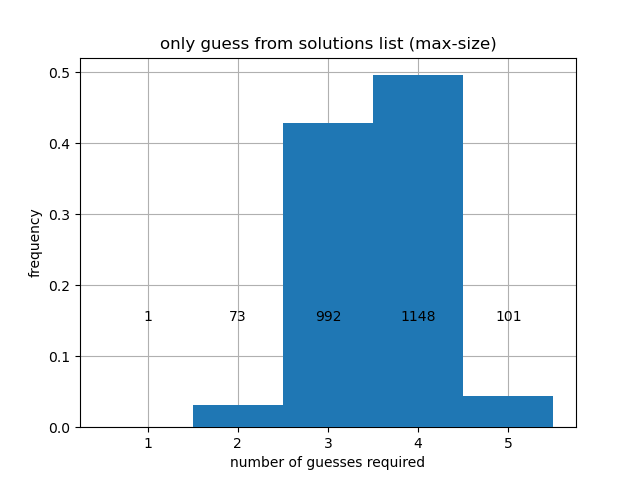

# Wordle Solver

This is simple [Wordle](https://www.powerlanguage.co.uk/wordle/) solver written in Julia.
The code is in the notebook [wordle_solver.ipynb](wordle_solver.ipynb), which contains all necessary instructions. For more information about how the solver works, keep reading!

## About the strategy

Wordle uses two word lists.
- `solutions.txt` is the set of words that might appear as solutions to the puzzle. This list contains 2315 words. 
- `nonsolutions.txt` is the set of words that can be used as guesses, but will never appear as solutions. Contains 10657 words.

I extracted these word lists directly from the Wordle source code (see [this article](https://bert.org/2021/11/24/the-best-starting-word-in-wordle/) for details). Every time we guess a word, we get to know whether any of the letters were correct and if they were in the right location in the word, similar to the game [Mastermind](https://en.wikipedia.org/wiki/Mastermind_(board_game)) but with words instead of colors. The information returned narrows down the list of possible solutions. Of course, we want to narrow down the list as much as possible, but the amount of narrowing depends on the information we receive.

**Example:** Initially, there are 2315 possible solutions. Suppose we try "STUMP" as our first word. Here are some possibilities:
- `"00000"`: none of the letters were correct. This still gives us useful information, and we can narrow down the list of possible solutions to 730 words.
- `"10000"`: only the "S" is in the solution, but it is in the wrong spot. This narrows down the list of possible solutions to 87 words.
- `"10201"`: the "U" is in the correct spot, and the "S" and "P" belong to the solution but are in the wrong spot. This narrows down our solution to only two possible words ("PAUSE" and "PLUSH").
- `"12000"`: the "T" is in the correct spot, and the "S" belongs to the solution but is in the wrong spot. Although this seems less restrictive than the previous case, there is only a single word that fits this description! ("ETHOS")

So whenever we pick a word, there is a _distribution_ of possible outcomes. Each different outcome (e.g. `"10201"`) has an associated number of possible solutions associated with it. If we get lucky, that number will be small. In the case of "STUMP", the worst possible case is that we strike out and are still left with 730 possible solutions.

### Max-size prioritization

One possible strategy is to consider this "worst possible case" and to pick the word for which the worst case has the shortest possible word list. Doing this leads to a first move choice of "ARISE" or "RAISE". With either of these first moves, again the worst possible outcome is that you strike out, except striking out now eliminates as many words as possible (mostly because r,s,a,i,e are very common letters). Starting with "ARISE" or "RAISE", we are guaranteed to reduce the list of possible solutions to no more than 168.

### Max-entropy prioritization

Another possible approach is to view the distribution over outcomes as a [probability mass function](https://en.wikipedia.org/wiki/Probability_mass_function) (PMF) and to pick the word that leads to a PMF with maximum [entropy](https://en.wikipedia.org/wiki/Entropy_(information_theory)). This biases the choice towards distributions that are _closer to being uniform_. By making the distribution close to uniform, we are ensuring that all possible outcomes are similarly bad (i.e. none of them are _too_ bad). The first move choice with the largest entropy is either "RAISE" or "SOARE", depending on whether you only use words in `solutions.txt` or allow all possible words, respectively.

## How well do these strategies work?

If we prioritize Max-size and use Max-entropy as a tiebreaker, we obtain the following histogram of results, depending on whether only use guesses from `solutions.txt` or whether we use all admissible words as valid guesses. The code for generating these histograms is in [performance.ipynb](performance.ipynb).

| |  |
|-|-|

As we can see, we always finish in at most 5 moves, no matter what the unknown word is. If instead we prioritize max-entropy, we obtain slightly different results, shown below.

| |  |
|-|-|

When prioritizing entropy, we get better average performance, but the worst-case performance is worse. Specifically, prioritizing entropy leads to a worst-case that may take 6 turns, although this is quite rare. Here is a summary of the four different cases considered above:

|Guesses allowed	| First guess	| Heuristic used	| Average Guesses	| # > 4 guesses |
|-----------------|-------------|-----------------|-----------------|---------------|
|Only from solutions list	| "RAISE"	| Max-size	| 3.551	| 101 |
|Only from solutions list	| "RAISE"	| Max-entropy |	3.495	| 93* |
|All 5-letter words	| "RAISE"	| Max-size |	3.521	| 73 |
|All 5-letter words	| "SOARE" |	Max-entropy	| 3.463	| 62* |

When using the Max-entropy heuristic (*), the worst case takes 6.

## How well can we hope to do?

The heuristics presented above are fundamentally _greedy_; we are only looking one move ahead when making each decision. For example, reducing the candidate word list at every turn does not mean the resulting smaller set of words will be easier to reduce in subsequent turns. I suspect there must exist better strategies that achieve e.g. a smaller expected number of moves, or a smaller probability of using 5 moves. 

It would be interesting to see if a more complicated strategy is able to guarantee a solution in 4 turns!
