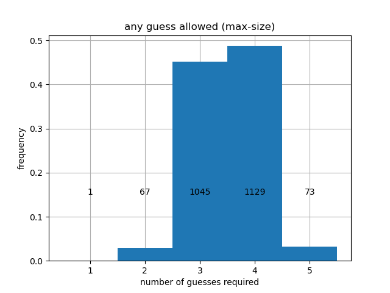

# Wordle Solver

This is simple [Wordle](https://www.powerlanguage.co.uk/wordle/) solver written in Julia.
The code is in the notebook [wordle_solver.ipynb](wordle_solver.ipynb)

## About the strategy

Wordle uses two word lists.
- `solutions.txt` is the set of words that might appear as solutions to the puzzle. This list contains 2315 words. 
- `nonsolutions.txt` is the set of words that can be used as guesses, but will never appear as solutions. Contains 10657 words.

Every time we guess a word, we get to know whether any of the letters were correct and if they were in the right location in the word, similar to the game [Mastermind](https://en.wikipedia.org/wiki/Mastermind_(board_game)) but with words instead of colors. The information returned narrows down the list of possible solutions. Of course, we want to narrow down the list as much as possible, but the amount of narrowing depends on the information we receive.

**Example:** Initially, there are 2315 possible solutions. Suppose we try "STUMP" as our first word. Here are some possibilities:
- `"00000"`: none of the letters were correct. This still gives us useful information, and we can narrow down the list of possible solutions to 730 words.
- `"10000"`: only the "S" is in the solution, but it is in the wrong spot. This narrows down the list of possible solutions to 87 words.
- `"10201"`: the "U" is in the correct spot, and the "S" and "P" belong to the solution but are in the wrong spot. This narrows down our solution to only two possible words ("PAUSE" and "PLUSH").
- `"12000"`: the "T" is in the correct spot, and the "S" belongs to the solution but is in the wrong spot. Although this seems less restrictive than the previous case, there is only a single word that fits this description! ("ETHOS")

In the case of "STUMP", the worst possible case is that we strike out and are still left with 730 possible solutions. My strategy for the first move is to pick the word for which the worst case is as good as possible. This turns out to be "ARISE" or "RAISE". With either of these first moves, again the worst possible outcome is that you strike out, except striking out now eliminates as many words as possible (mostly because r,s,a,i,e are very common letters). Starting with "ARISE" or "RAISE", we are guaranteed to reduce the list of possible solutions to no more than 168.

My strategy is to continue in this fashion, always picking the word that leads to the largest worst-case reduction in candidate word list size. When there are ties, I use the following procedure:
1. First, I prioritize guess words that actually belong to the list of remaining possible solutions. Sometimes guessing a word that isn't on the list of remaining solutions can be just as effective in the worst case sense, but I discard such options because they make it impossible to win in one turn.
2. If there are still multiple candidate guess words, I compute the probability mass function across all possible outcomes, and pick the one with the largest [entropy](https://en.wikipedia.org/wiki/Entropy_(information_theory)). This biases the choice towards distributions that are _closer to being uniform_. It turns out that "RAISE" has slightly higher entropy than "ARISE", so my choice for the first guess is "RAISE".

## How well does this work?

The strategy is guaranteed to find the solution in 5 moves or fewer. Here is a histogram of how many turns it takes for all 2315 words.

So we will win in 2 moves 65 times out of 2315 (2.8% of the time), we will win in 3 moves 45.1% of the time, 4 moves 48.8% of the time, and 5 moves 3.2% of the time. In all, this leads to an expected finishing time of 3.52 moves. Not bad! This assumes we are allowed to use the full set of available words as guesses, so sometimes the procedure will lead to using very unusual/uncommon words. It turns out that if you restrict the strategy to only use words from the smaller set `solutions.txt`, you can do almost as well. Here is the histogram when you limit yourself to that case:

Still, we are guaranteed to finish in 5 moves or fewer, and the expected value is only a bit higher than when all words are allowed, at 3.55 moves on average.

## How well can we hope to do?

The heuristic I presented above is fundamentally _greedy_; we are only looking one move ahead when making each decisions. Simply because the candidate word list was reduced as much as possible, that doesn't mean the resulting smaller set of words will be easier to reduce in subsequent turns. I suspect there must exist better strategies that acheive e.g. a smaller expected number of moves, or a smaller probability of using 5 moves. 

It would be interesting to see if a more complicated strategy is able to guarantee that a solution can be found in 4 turns!
